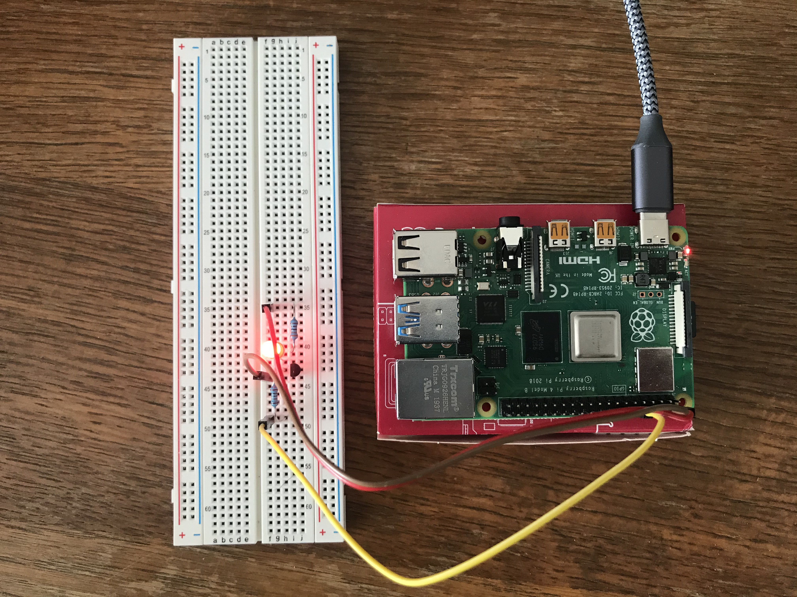
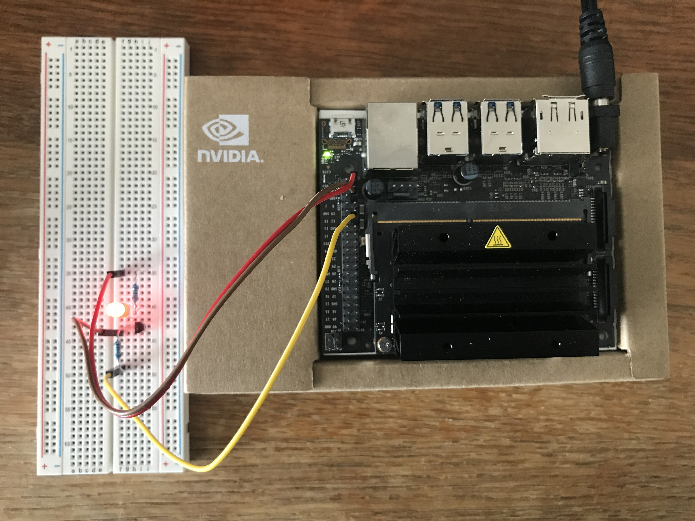
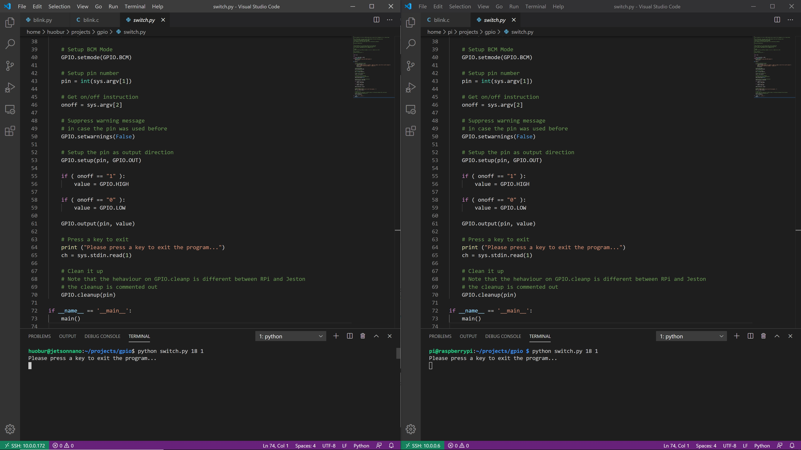
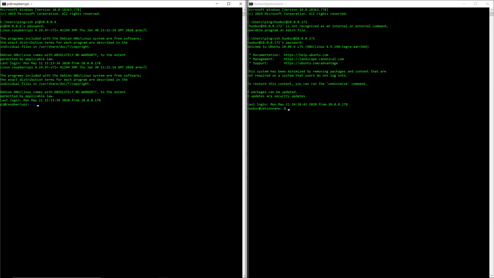

# Program GPIO on Raspberry Pi and Jetson Nano with multiple languages

There have been plenty articles related on how to work with GPIO on Raspberry Pi or Jetson Nano, this project is trying to focus on how to simplify things and write portable programs to run on multiple systems.

We'll build a simply led circuit connected by a transistor with the base plugged into a GPIO pin for our programs to control.

3 programming languages (script) will be used:
1. C programming language
2. Python programming language, and
3. Bash script

Each of the above programs will be used to control the led circuit on both Raspberry Pi and Jetson Nano systems to demo how to write a portable program for multiple systems.


<br>
<h2>Fig. 1 Two System Demo</h2>

<br>

## 1. System configurations:
#### Raspberry Pi 4 Model B Rev 1.2 2019 
* Quad Core ARM 64 Bit WiFi Bluetooth (4GB) (with Linux raspberrypi 4.19.97-v7l+)
* RPi.GPIO was installed on the system (for Python programming)
* gcc (Raspbian 8.3.0-6+rpi1) 8.3.0 (for C programming)

#### Jetson Nano B01 
* Quad Core ARM 64 Bit (4GB) without WiFi/BT (with Linux jetsonnano 4.9.140-tegra)
* NVIDIA Jetson Nano developer Kit is installed
* The following GPIO package is also installed (for Python programming)
* https://github.com/NVIDIA/jetson-gpio
* gcc (Ubuntu/Linaro 7.5.0-3ubuntu1~18.04) 7.5.0 (for C programming)
* OKN WiFi 6 AX200 802.11ax WiFi Card is added and configured

- **Both systems are configured for SSH and VNC access through WiFi, such that they can be run headless with only power cable physically connected.**

#### Host PC is a Windows 10 machine
- TightVNC (v0.51.0) is installed and configured
- VSCode (v1.45.0) is installed
- Remote-SSH (v0.51.0) extension is added to VSCode

####
With the above configurations, I can simply access either of Raspberry Pi or Jetson Nano or both of through my PC in the following 3 methods:
1. Through a commandline SSH;
2. Through VSCode via Remote-SSH;
3. Through TightVNC when absolutely needed.

####

# 2. LED Circuit Design
## Components
* Red LED (x2)
* Transistor NPN PN2222 (x2)
* Resistor 10K (x2)  330 (x2)
* Breadboard (x1)
* Female-to-Male Depont Wire (x6)

Note that the above components are for building two identical circuits for both Raspberry Pi and Jetson Nano systems as shown in Fig.1, you can also just build one circuit and manually switch to one system at a time. By using online free trial design tool (https://www.digikey.com/schemeit/project/), we have Fig. 2 to show the circuit diagram. Since this is very simple circuit, once we plug in all components on the breadboard, we can connect the three wires on each circuit to the same corresponding physical pins on the two systems: (if you just build one circuit, you can test your circuit and code with one system at a time). Since this is a fairly simple circuit, details are not going to be explained. Basically, we use the base of the transistor for our software program to control the switch on/off of the LED through a GPIO pin on the system board.
1. The female end of the wire with "5V" showing on the circuit diagram should be plugged in the pin 2 on the system board;
2. The female end of the wire with "GND" showing on the circuit diagram should be plugged in the pin 6 on the system board;
3. The female end of the wire with "To Pin 12" showing on the circuit diagram should be plugged in the pin 12 on the system board.
(Tip: once you finish connecting everything, you can simply connect LED cathode end directly to the ground on the system board. The LED should be lit, if not, you may have a bad LED)

<br>
<h2>Fig. 2 LED Circuit Diagram</h2>

<br>

# 3. Software Design
Now it's time to design our software. Our goal is to design software to control the LED. To show the effect, we plan to turn the red LED on and off 10 times, with 1 second time interval between on and off. Once done, we'll exit our program. This is pretty simple, however as we stated earlier, our focus is to write portable software such that the software can be run on two system without any code change. This exercise helps us to how to use our program to detect different systems and act differently.

## BASH Shell Script - blink.sh
Let's start with bash script first since it doesn't need any compiler or interpreter to run it:

```
# Check to see if the computer model file exists or not
FILE=/proc/device-tree/model
if [ ! -f "$FILE" ]; then
    echo "Blink only runs on Raspberry Pi 4 or Jetson Nano"
    echo "Please check your computer model"
    exit 0
fi

# Get the computer model string
# You can add elif to support other computer configurations
# with different GPIO pin layouts
model=$(tr -d '\0' < /proc/device-tree/model)

gpio='gpio'

if [[ $model =~ "NVIDIA Jetson Nano" ]]
then
    # Jetson Nano gpio79 is pin 12 on the board
    pin='79'
	
elif [[ $model =~ "Raspberry Pi 4" ]]
then
    # Raspberry Pi 4 gpio18 is pin 12 on the board
    pin='18'
	
else
    echo "Blink only runs on Raspberry Pi 4 or Jetson Nano"
    echo "Please check your computer model"
	
    exit 0
fi

# Setup the GPIO pin
gpiopin="${gpio}""${pin}"
	
# Set the pin to export
echo "${pin}" > /sys/class/gpio/export

# Set Direction to output
echo out > /sys/class/gpio/${gpiopin}/direction

# loop 10 times
for number in {1..10}
do
    echo 1 > /sys/class/gpio/${gpiopin}/value
    sleep 1s
	
    echo 0 > /sys/class/gpio/${gpiopin}/value
	sleep 1s
	
done

# Clean GPIO Pin
echo "${pin}" > /sys/class/gpio/unexport
```

I know that you just want to try to see if this works, please go ahead and copy the script, save it to "blink.sh". You can then run it on your system, please note that you need to run it with root privilege:
```
sudo ./blink.sh
```
Does it work? if yes, congratulations!
If not, have you forgot to make the file executable?
```
chmod +x blink.sh
```
That should fix the issue provided that the circuit is connected correctly.

In this script, there are couple of sections which take care of different different tasks:
1. Detect and identify what system the script is run under: there are many ways to get a specific task done in software business, in this script, we are looking into a file in the system "/proc/device-tree/model". The thing here is that we know that both Raspberry Pi and Jetson Nano do have such file with their identifies in it such that we can successfully run our script on both systems. However, someone may try to run the script on other systems, since we have not exhausted our test on other systems, we need to be carefully to see if the file exists or not. (I quickly tested on my host PC, WSL subsystem doesn't have such file to give one example to avoid such problem):

```
# Check to see if the computer model file exists or not
FILE=/proc/device-tree/model
if [ ! -f "$FILE" ]; then
    echo "Blink only runs on Raspberry Pi 4 or Jetson Nano"
    echo "Please check your computer model"
    exit 0
fi
```
So, the script above assign the computer model file with its path to "FILE" variable, and then test its existence, if it doesn't exist, print out warning message and exit the script. Otherwise, we continue. 

2. the next second of the script is to find out if we have Raspberry Pi or Jetson Nano or something else even if we have detected that the computer model file does exist in our earlier discussion:
```
# Get the computer model string
# You can add elif to support other computer configurations
# with different GPIO pin layouts
model=$(tr -d '\0' < /proc/device-tree/model)

gpio='gpio'

if [[ $model =~ "NVIDIA Jetson Nano" ]]
then
    # Jetson Nano gpio79 is pin 12 on the board
    pin='79'
    
elif [[ $model =~ "Raspberry Pi 4" ]]
then
    # Raspberry Pi 4 gpio18 is pin 12 on the board
    pin='18'
    
else
    echo "Blink only runs on Raspberry Pi 4 or Jetson Nano"
    echo "Please check your computer model"
    
    exit 0
fi
```

We get the computer model string and assigned it to "model" variable. The only tricky thing here is the "tr -d '\0'" part, which is to get rid of the null byte in the string to suppress a warning from the system if you don't do this.

The model string is tested againt "NVIDA Jetson Nano" and "Raspberry Pi 4", if a match found, corresponding pin number either "79" or "18" is assigned, which in turn cancatenated to "gpiopin" variable:
```
# Setup the GPIO pin
gpiopin="${gpio}""${pin}"
```
If neither Jetson Nano nor Raspberry Pi is detected, we print out a warning messaage and exit the script.

3. Once we get to this point successfully, we are ready to work with GPIO:
```
# Set the pin to export
echo "${pin}" > /sys/class/gpio/export

# Set Direction to output
echo out > /sys/class/gpio/${gpiopin}/direction
```
To enable a GPIO function, we need to write the specific pin to export.GPIO also has directions: input or output. In our design and example, we are using the output functionality.

4. After all of the above preparation and setup, we are good to go to loop through 10 times for us to observe our spectacular LED show:
```
# loop 10 times
for number in {1..10}
do
    echo 1 > /sys/class/gpio/${gpiopin}/value
    sleep 1s
    
    echo 0 > /sys/class/gpio/${gpiopin}/value
    sleep 1s
    
done
```
When we set "1" to the GPIO value, the GPIO pin goes to high voltage state, which in turn triggers our red LED lit, we then let the show last for 1 second, and turn the GPIO pin to "0" which in turn switches voltage to low state, thus turns the LED off for a 1 second. After 10 times of the interchanges, we  are all done and out of the loop.

5. As a good engineer, we always clean up things after our tasks are done and let's keep it that way for our or others' next show:
```
# Clean GPIO Pin
echo "${pin}" > /sys/class/gpio/unexport
```

After our first walking through our script process, it should be much easier to go through the other two programs below.

## C Program - blink.c
```
#include <errno.h>
#include <fcntl.h>
#include <stdio.h>
#include <stdlib.h>
#include <string.h>
#include <sys/stat.h>
#include <sys/types.h>
#include <unistd.h>

int main()
{
	char JetsonNano[] = "NVIDIA Jetson Nano";
	char RPi4[] = "Raspberry Pi 4";
	char model[] = "/proc/device-tree/model";
	char export[] = "/sys/class/gpio/export";
	char unexport[] = "/sys/class/gpio/unexport";
	char gpio[] = "/sys/class/gpio/gpio";
	char out[] = "out";
	char p18[] = "18";
	char p79[] = "79";
	char high[] = "1";
	char low[] = "0";
	char pin[4];
	char direction[256] = "";
	char value[256] = "";
	
    FILE *stream;
    char line[256];
    int len = 256;

    // Find the computer model we support:
    stream = fopen(model, "r");
    if ( stream == NULL ) {
        perror("Error: it cannot run the program as it doesn't know the computer model!");
		
        exit(EXIT_FAILURE);
    } else {
		fgets(line, len, stream);
		
        if ( (line != NULL) && (strstr(line,JetsonNano) != NULL) ) {
			strcpy(pin,p79);
		} else if ( (line != NULL) && (strstr(line,RPi4) != NULL) ) {
			strcpy(pin,p18);
		} else {
			// something wrong: clean up and exit
            fclose(stream);
			
			perror("Error: it cannot run this program as it doesn't support the computer model!");
			
			exit(EXIT_FAILURE);
		}
		
		// build direction and value paths/files
		// /sys/class/gpio/gpioxx/direction
		// /sys/class/gpio/gpioxx/value
		strcat(direction, gpio);
		strcat(direction, pin);
		strcat(value,direction);
		strcat(value,"/value");
		strcat(direction, "/direction");
			
	    // found a board we support, clean up and continue		
        fclose(stream);
	}

    // Check and setup export
    int fd = open(export, O_WRONLY);
    if (fd == -1) {
        perror("Error: cannot open the export file!");
        exit(EXIT_FAILURE);
    }

    if (write(fd, pin, 2) != 2) {
        perror("Error: cannot write to the export!");
        exit(EXIT_FAILURE);
    }

    close(fd);

    // Check and setup direction to output
    fd = open(direction, O_WRONLY);
    if (fd == -1) {
        perror("Error: cannot open the direction file!");
        exit(EXIT_FAILURE);
    }

    if (write(fd, out, 3) != 3) {
        perror("Error: cannot write the direction!");
        exit(EXIT_FAILURE);
    }

    close(fd);

    fd = open(value, O_WRONLY);
    if (fd == -1) {
        perror("Error: cannot open the value file!");
        exit(EXIT_FAILURE);
    }

    // Ready to go and loop 10 times with one second intervals
    for (int i = 0; i < 10; i++) {
        if (write(fd, high, 1) != 1) {
            perror("Error: cannot write the value!");
            exit(EXIT_FAILURE);
        }
        sleep(1);

        if (write(fd, low, 1) != 1) {
            perror("Error: cannot write the value!");
            exit(EXIT_FAILURE);
        }
        sleep(1);
    }

    close(fd);

    // We are done and clean up with the unexport
    fd = open(unexport, O_WRONLY);
    if (fd == -1) {
        perror("Error: cannot open the unexport file!");
        exit(EXIT_FAILURE);
    }

    if (write(fd, pin, 2) != 2) {
        perror("Error: cannot write the unexport!");
        exit(EXIT_FAILURE);
    }

    close(fd);

    return 0;
}

```

To run it, please copy the code and save it to a file, say, "blink.c". Since it's such at simple program, we don't have a make or build filie, but simply get it compiled quickly from command line:
```
gcc -o blink blink.c
```
if no erro is spelled out, you can run it:
```
sudo ./blink
```

C is very powerful and primitive programming language, in this program, we tend to design a lot of strings such that we can avoid embedded text string in the code. We also spend quite a few steps to concatenate strings to work with each of our tasks. The programming logic and workflow are very much similar to the ones we went to the details in our previous "blink.sh" discussion. One should have no problem to compare the steps and follow through. Couple of things to note: we don't allocate and free memories and simply use stack for all of our string manipulations. And we check error conditions a lot, which should be a good thing to do in our projects. Of cause, we need to be diligent to clean up in each step.

## Python Program - blink.py
```
# Both Raspberry Pi 4 and Jetson Nano can be supported by Mode BCM Pin 18 mapped on BOARD Pin 12.
#
import sys
import time

# Check if GPIO module is available or not
try:
    import RPi.GPIO as GPIO
except ImportError:
    print ("Cannot locate RPi.GPIO module!")
    sys.exit(1)

# Check to see if we have found the system we support
def checkSystem(line):
    if ( ('NVIDIA Jetson Nano' not in line) and ('Raspberry Pi 4' not in line) ): 
        print ("The system is not supported by this program!")
        sys.exit(1)

def main():
    # Exam the system model file
    try:
        with open('/proc/device-tree/model') as f:
            for line in f:
                checkSystem(line)
                break
    except Exception as error:
        print ("The system is not supported by this program!")
        sys.exit(1)
    
    # Setup BCM Mode
    GPIO.setmode(GPIO.BCM)
    
    # Setup pin number
    pin =  18

    # Setup the pin as output direction
    GPIO.setup(pin, GPIO.OUT)
  
    # Loop 10 times with one second intervals
    for i in range(10):
        # Output pin value high and then sleep for 1 second    
        value = GPIO.HIGH
        GPIO.output(pin, value)
        time.sleep(1)
        
        # Output pin value low and then sleep for 1 second
        value = GPIO.LOW
        GPIO.output(pin, value)
        time.sleep(1)       

    # Clean it up
    GPIO.cleanup()

if __name__ == '__main__':
    main()
```

Although with the similar logic and workflow as in previous blink.sh and blink.c programs, the Python program version blink.py does have several differences to be taken care of:
1. Since GPIO support for Python could be installed as a package, for instance, in our Jetson Nano system, we had to install from https://github.com/NVIDIA/jetson-gpio such that we can import it in our program. For this, we added a check to see if the package is actually installed or not:
```
# Check if GPIO module is available or not
try:
    import RPi.GPIO as GPIO
except ImportError:
    print ("Cannot locate RPi.GPIO module!")
    sys.exit(1)
```
2. Jetson.GPIO package supports 4 different modes: GPIO.BOARD, GPIO.BCM, GPIO.CVM and GPIO.TEGRA_SOC. Since we are designing a program to be compatible with Raspberry Pi and RPi.GPIO supports BCM mode, why don't we want to make our lives hard? So we pick BCM mode for both Raspberry Pi and Jetson Nano systems, and the pin numbers are matched well such that we don't even need to select different pin numbers as we did in our earlier programs. We actually made our life earlier!
```
    # Setup BCM Mode
    GPIO.setmode(GPIO.BCM)
    
    # Setup pin number
    pin =  18

    # Setup the pin as output direction
    GPIO.setup(pin, GPIO.OUT)
```
The following looping 10 times code is just like reading through a paragraph of English text, there should be no problem understand it. And finally as we are all good coders, we clean it up when finished!
```

    # Loop 10 times with one second intervals
    for i in range(10):
        # Output pin value high and then sleep for 1 second    
        value = GPIO.HIGH
        GPIO.output(pin, value)
        time.sleep(1)
        
        # Output pin value low and then sleep for 1 second
        value = GPIO.LOW
        GPIO.output(pin, value)
        time.sleep(1)       

    # Clean it up
    GPIO.cleanup()
```

## Bonus - switch.py
```
# Both Raspberry Pi 4 and Jetson Nano can be supported
# Please note the mapping between mode and board pins
# For instance: Mode BCM Pin 18 is BOARD Pin 12.
#
# Usage:
# python switch.py (BCM pin number) (1 or 0 -- means on or off)
#
# For instance: 
# python switch.py 18  1
#

import sys

try:
    import RPi.GPIO as GPIO
except ImportError:
    print ("Cannot locate RPi.GPIO module!")
    sys.exit(1)

# Check to see if we have found the system we support
def checkSystem(line):
    if ( ('NVIDIA Jetson Nano' not in line) and ('Raspberry Pi 4' not in line) ): 
        print ("The system is not supported by this program!")
        sys.exit(1)

def main():
    # Exam the system model file
    try:
        with open('/proc/device-tree/model') as f:
            for line in f:
                checkSystem(line)
                break
    except Exception as error:
        print ("The system is not supported by this program!")
        sys.exit(1)

    # Check commandline inputs
    if ( len(sys.argv) < 3 ):
        print ("Please provide two numbers: (BCM pin number; and 1/0 for on/off output)")
        print ("python switch.py number_1  number_2")
        sys.exit(1)

    # Setup BCM Mode
    GPIO.setmode(GPIO.BCM)
    
    # Setup pin number
    pin = int(sys.argv[1])

    # Get on/off instruction
    onoff = sys.argv[2]

    # Suppress warning message 
    # in case the pin was used before
    GPIO.setwarnings(False)

    # Setup the pin as output direction
    GPIO.setup(pin, GPIO.OUT)

    if ( onoff == "1" ):  
        value = GPIO.HIGH
        
    if ( onoff == "0" ):
        value = GPIO.LOW

    GPIO.output(pin, value)

    # Press a key to exit
    print ("Please press a key to exit the program...")
    ch = sys.stdin.read(1)

    # Clean it up
    # Note that the hehaviour on GPIO.cleanp is different between RPi and Jeston
    # the cleanup is commented out
    GPIO.cleanup(pin)

if __name__ == '__main__':
    main()
```
Here is the bonus program, which is actually the one I used to test my programs and systems. It's useful to test pin or other thing step by step. You can run it by providing two parameters:
```
python switch.py <pin number> <1 or 0>
```

I even use it to take the picture of Fig. 1 (turned both LEDs on)
Also I found an inconsistence between RPi.GPIO on Raspberry Pi and Jetson Nano: once you turn the LED on and exit the program even after clean up, the LED on Jetson Nano stays on while the LED on Raspberry Pi turns off. Try it youself!
I also noticed another issue: if one doesn't cleanup before exit, you'll get an error message or sometimes you even cannot continue running your program until you clean the system up! There is an easy way to use one of the statements in blink.sh, but this is for your homework to find it out if you really want to dive into it. 

## Appendix - System Configuration Images
<br>
<h2>Fig. 3 Raspberry Pi</h2>

<br>

<br>
<h2>Fig. 4 Jetson Nano</h2>

<br>

<br>
<h2>Fig. 5 VCCode Access</h2>

<br>


<br>
<h2>Fig. 6 Command Line Access</h2>

<br>

<br>
<h2>Fig. 7 VNC Access</h2>

<br>


