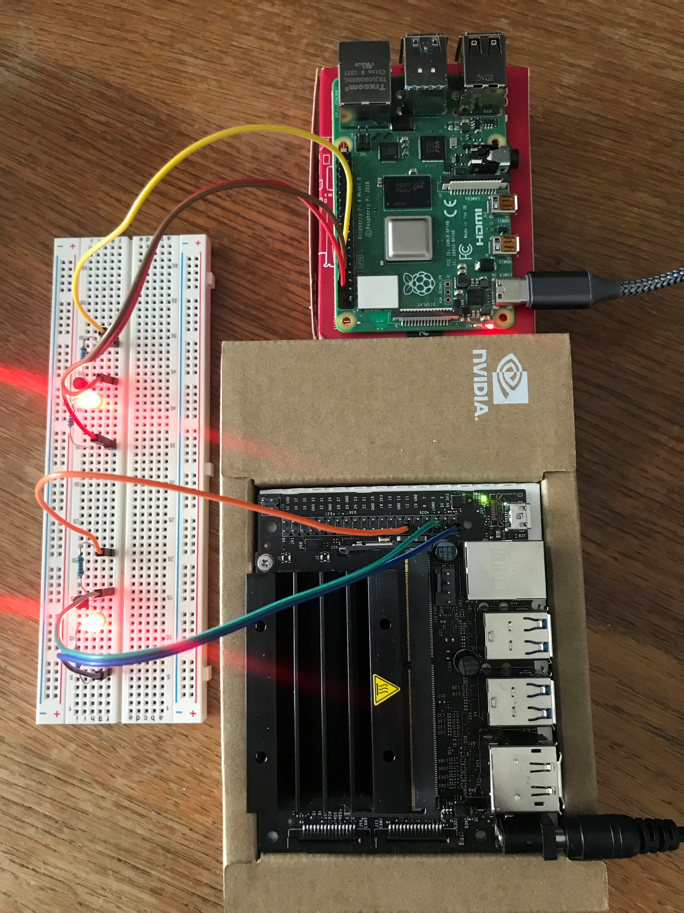

# Program GPIO on Raspberry Pi and Jetson Nano with multiple languages

There have been plenty articles related on how to work with GPIO on Raspberry Pi or Jetson Nano, this project is trying to focus on how to simplify things and write portable programs to run on multiple systems.

We'll build a simply led circuit connected by a transistor with the base plugged into a GPIO pin for our programs to control.

3 programming languages (script) will be used:
1. C programming language
2. Python programming language, and
3. Bash script

Each of the above programs will be used to control the led circuit on both Raspberry Pi and Jetson Nano systems to demo how to write a portable program for multiple systems.

 
<h2>Fig. 1 Two System Demo</h2>

 

## 1. System configurations:
#### Raspberry Pi 4 Model B Rev 1.2 2019 
* Quad Core ARM 64 Bit WiFi Bluetooth (4GB) (with Linux raspberrypi 4.19.97-v7l+)
* RPi.GPIO was installed on the system (for Python programming)
* gcc (Raspbian 8.3.0-6+rpi1) 8.3.0 (for C programming)

#### Jetson Nano B01 
* Quad Core ARM 64 Bit (4GB) without WiFi/BT (with Linux jetsonnano 4.9.140-tegra)
* NVIDIA Jetson Nano developer Kit is installed
* The following GPIO package is also installed (for Python programming)
* https://github.com/NVIDIA/jetson-gpio
* gcc (Ubuntu/Linaro 7.5.0-3ubuntu1~18.04) 7.5.0 (for C programming)
* OKN WiFi 6 AX200 802.11ax WiFi Card is added and configured

- **Both systems are configured for SSH and VNC access through WiFi, such that they can be run headless with only power cable physically connected.**

#### Host PC is a Windows 10 machine
- TightVNC (v0.51.0) is installed and configured
- VSCode (v1.45.0) is installed
- Remote-SSH (v0.51.0) extension is added to VSCode

####
With the above configurations, I can simply access either of Raspberry Pi or Jetson Nano or both of through my PC in the following 3 methods:
1. Through a commandline SSH;
2. Through VSCode via Remote-SSH;
3. Through TightVNC when absolutely needed.

####

